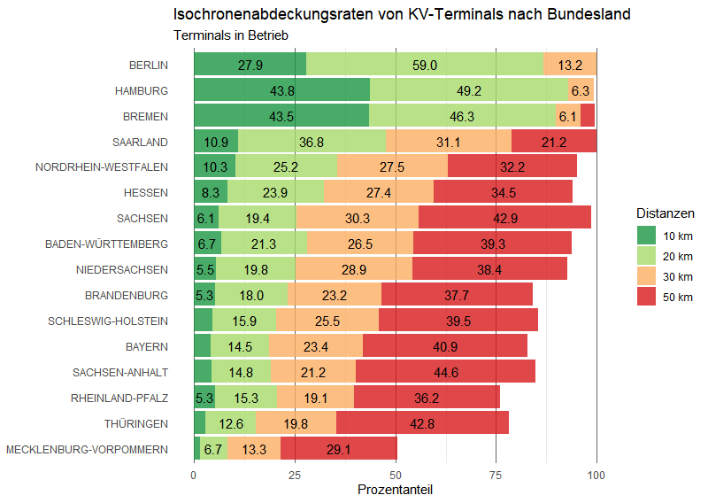

⚠️ **Hinweis:** Diese README ist nicht final. Die Inhalte befinden sich in Bearbeitung.

# Analyse der räumlichen Abdeckung von KV-Terminals in Deutschland  
**im Kontext der Mautdaten des Projekts VerMoL**

Die nachfolgenden Visualisierungen gehen auf die Seminararbeit "Analyse der räumlichen Abdeckung von KV-Terminals in Deutschland - im Kontext der Mautdaten des Projekts VerMoL" ([📄 Seminararbeit als PDF ansehen](https://github.com/MartinHoblisch/KV-Terminals-Public/blob/d6b9e1a54a89824e4e0d12c574449caa1a3ad219/Analyse_der_r%C3%A4umlichen_Abdeckung_von_KV_Terminals_in_Deutschland_signed.pdf)) zurück und werden seither kontinuierlich weiterentwickelt.
 
Für die Erhebung der Terminalstandorte wurde die Karte der Studiengesellschaft für den Kombinierten Verkehr e.V. (SGKV) als Datengrundlage verwendet. Die SGKV ist ein etablierter gemeinnütziger Verein, der relevante Akteure aus Wissenschaft und Praxis im Bereich des Kombinierten Verkehrs vernetzt und bietet mit ihrer aktuellen und hochwertigen Datenbasis eine verlässliche Quelle. Die Karte ist unter folgendem Link zugänglich: http://www.intermodalmap.com/. Da sich die Untersuchung auf die Verkehrsverlagerung von der Straße auf die Schiene konzentriert fließen folgende Terminalkategorien in die Betrachtung ein:

- Trimodal
- Schiene / Straße
- Weitere Umschlaganlage
- Anlage im Bau / projektiert
- ~~Wasserstraße / Straße~~
- ~~Containerdepot~~

**KV-Terminal Isochronendarstellung Deutschland:**

- Darstellung der Isochronen für bestehende Terminals
https://martinhoblisch.github.io/KV-Terminals-Public/Ist.html

- Darstellung der Isochronen für bestehende und geplante Terminals
https://martinhoblisch.github.io/KV-Terminals-Public/Soll.html

**Prozentuale Terminalabdeckung aller Terminals in Deutschland:**

- NUTS-3-Darstellung aller bestehenden Terminals
https://martinhoblisch.github.io/KV-Terminals-Public/NUTS3_ist.html

- NUTS-3-Darstellung aller bestehenden und geplanten Terminals
https://martinhoblisch.github.io/KV-Terminals-Public/NUTS3_soll.html

  

**KV-Terminal Isochronendarstellung Europa:**

- Darstellung der Isochronen für bestehende Terminals
https://martinhoblisch.github.io/KV-Terminals-Public/Europa_Ist.html

- Darstellung der Isochronen für bestehende und geplante Terminals
https://martinhoblisch.github.io/KV-Terminals-Public/Europa_Soll.html

**In Bearbeitung:**

- https://martinhoblisch.github.io/KV-Terminals-Public/Ist_Industrie.html
- https://martinhoblisch.github.io/KV-Terminals-Public/Ist_Industrie_Union.html
